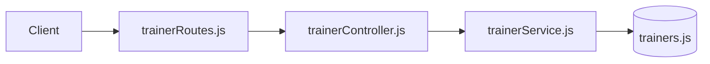
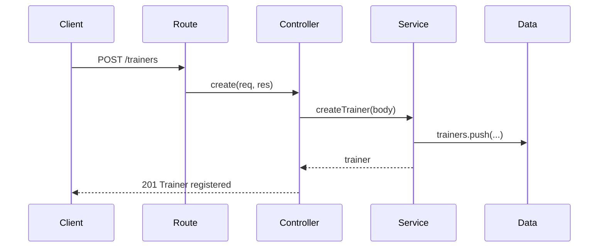
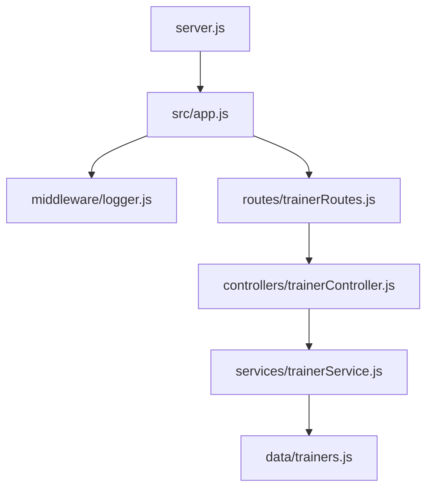

## Arkitektur

```mermaid
flowchart LR
    Client[Client] --> Routes[trainerRoutes.js]
    Routes --> Controller[trainerController.js]
    Controller --> Service[trainerService.js]
    Service --> Data[(trainers.js)]
```

```mermaid
sequenceDiagram
    Client->>Route: POST /trainers
    Route->>Controller: create(req, res)
    Controller->>Service: createTrainer(body)
    Service->>Data: trainers.push(...)
    Service-->>Controller: trainer
    Controller-->>Client: 201 Trainer registered
```

```mermaid
flowchart TD
    Server[server.js] --> App[src/app.js]
    App --> Logger[middleware/logger.js]
    App --> Routes[routes/trainerRoutes.js]
    Routes --> Controller[controllers/trainerController.js]
    Controller --> Service[services/trainerService.js]
    Service --> Data[data/trainers.js]
```